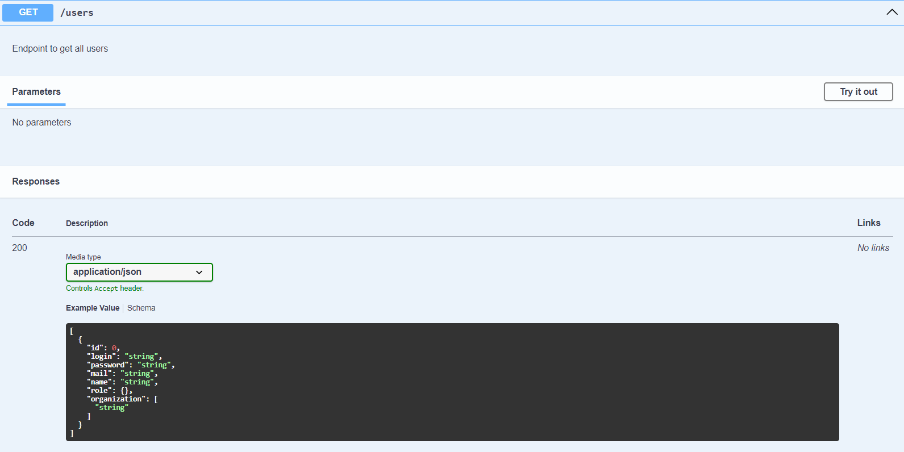
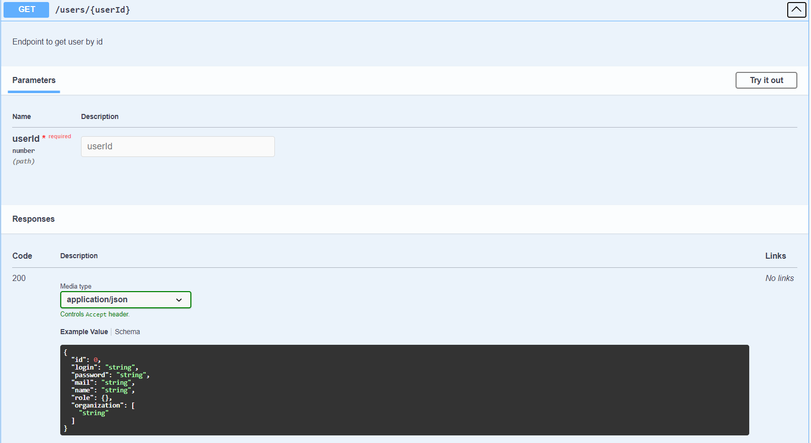
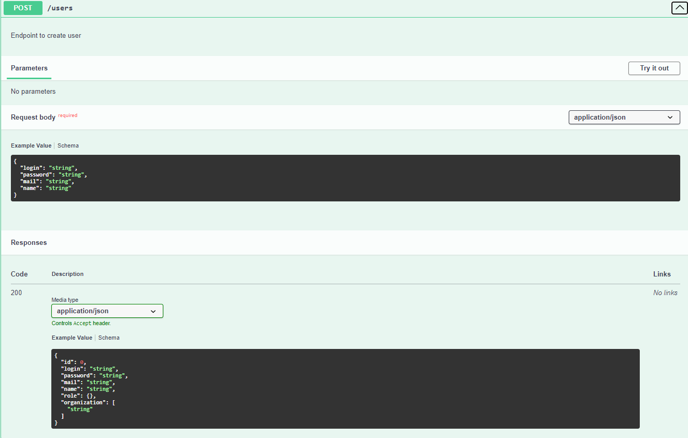
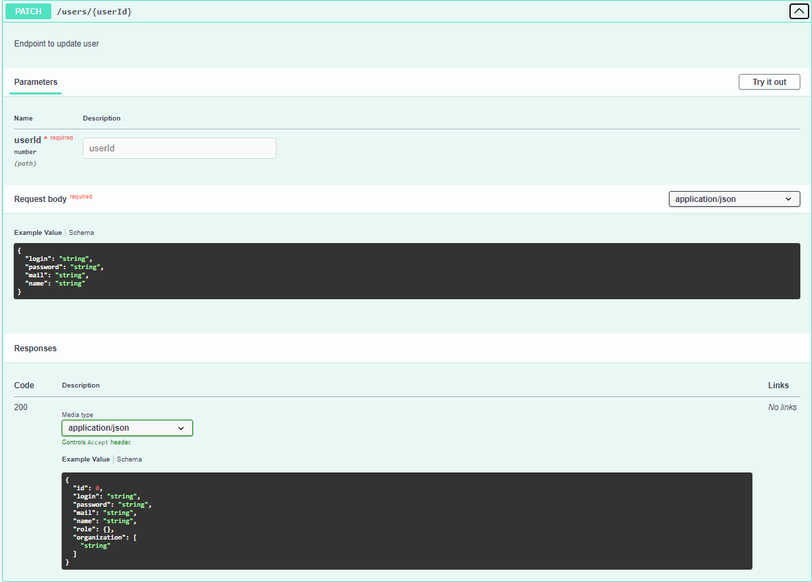
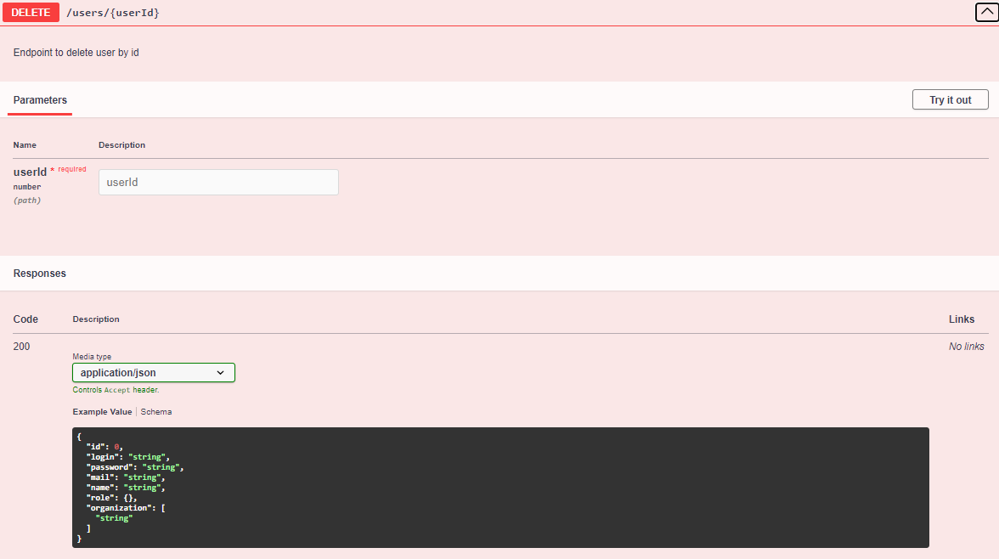

# Реалізація інформаційного та програмного забезпечення

В рамках проекту розробляється:
- ~~SQL-скрипт для створення на початкового наповнення бази даних~~
- RESTfull сервіс для управління даними

## SQL-Скрипт для створення початкового наповнення бази даних
```sql
-- MySQL Workbench Forward Engineering

SET @OLD_UNIQUE_CHECKS=@@UNIQUE_CHECKS, UNIQUE_CHECKS=0;
SET @OLD_FOREIGN_KEY_CHECKS=@@FOREIGN_KEY_CHECKS, FOREIGN_KEY_CHECKS=0;
SET @OLD_SQL_MODE=@@SQL_MODE, SQL_MODE='ONLY_FULL_GROUP_BY,STRICT_TRANS_TABLES,NO_ZERO_IN_DATE,NO_ZERO_DATE,ERROR_FOR_DIVISION_BY_ZERO,NO_ENGINE_SUBSTITUTION';

-- -----------------------------------------------------
-- Schema mydb
-- -----------------------------------------------------
DROP SCHEMA IF EXISTS `mydb` ;

-- -----------------------------------------------------
-- Schema mydb
-- -----------------------------------------------------
CREATE SCHEMA IF NOT EXISTS `mydb` DEFAULT CHARACTER SET utf8 ;
USE `mydb` ;

-- -----------------------------------------------------
-- Table `mydb`.`Organization_list`
-- -----------------------------------------------------
DROP TABLE IF EXISTS `mydb`.`Organization_list` ;

CREATE TABLE IF NOT EXISTS `mydb`.`Organization_list` (
  `id` INT NOT NULL AUTO_INCREMENT,
  `list_of_organizations` VARCHAR(45) NOT NULL,
  PRIMARY KEY (`id`))
ENGINE = InnoDB;


-- -----------------------------------------------------
-- Table `mydb`.`Role`
-- -----------------------------------------------------
DROP TABLE IF EXISTS `mydb`.`Role` ;

CREATE TABLE IF NOT EXISTS `mydb`.`Role` (
  `id` INT NOT NULL AUTO_INCREMENT,
  `name` VARCHAR(45) NOT NULL,
  `description` VARCHAR(45) NULL,
  PRIMARY KEY (`id`))
ENGINE = InnoDB;


-- -----------------------------------------------------
-- Table `mydb`.`User`
-- -----------------------------------------------------
DROP TABLE IF EXISTS `mydb`.`User` ;

CREATE TABLE IF NOT EXISTS `mydb`.`User` (
  `id` INT NOT NULL AUTO_INCREMENT,
  `login` VARCHAR(45) NOT NULL,
  `password` VARCHAR(45) NOT NULL,
  `mail` VARCHAR(45) NULL,
  `name` VARCHAR(45) NULL,
  `Organization_list_id` INT NOT NULL,
  `Role_id` INT NOT NULL,
  PRIMARY KEY (`id`, `Organization_list_id`),
  UNIQUE INDEX `login_UNIQUE` (`login` ASC) VISIBLE,
  INDEX `fk_User_Organization_list1_idx` (`Organization_list_id` ASC) VISIBLE,
  INDEX `fk_User_Role1_idx` (`Role_id` ASC) VISIBLE,
  CONSTRAINT `fk_User_Organization_list1`
    FOREIGN KEY (`Organization_list_id`)
    REFERENCES `mydb`.`Organization_list` (`id`)
    ON DELETE NO ACTION
    ON UPDATE NO ACTION,
  CONSTRAINT `fk_User_Role1`
    FOREIGN KEY (`Role_id`)
    REFERENCES `mydb`.`Role` (`id`)
    ON DELETE NO ACTION
    ON UPDATE NO ACTION)
ENGINE = InnoDB;


-- -----------------------------------------------------
-- Table `mydb`.`Rating`
-- -----------------------------------------------------
DROP TABLE IF EXISTS `mydb`.`Rating` ;

CREATE TABLE IF NOT EXISTS `mydb`.`Rating` (
  `id` INT NOT NULL AUTO_INCREMENT,
  `value` FLOAT NOT NULL,
  PRIMARY KEY (`id`))
ENGINE = InnoDB;


-- -----------------------------------------------------
-- Table `mydb`.`Data`
-- -----------------------------------------------------
DROP TABLE IF EXISTS `mydb`.`Data` ;

CREATE TABLE IF NOT EXISTS `mydb`.`Data` (
  `id` INT NOT NULL AUTO_INCREMENT,
  `size` VARCHAR(45) NOT NULL,
  `format` VARCHAR(45) NOT NULL,
  `name` VARCHAR(45) NOT NULL,
  `uploadedAt` DATETIME NOT NULL,
  PRIMARY KEY (`id`))
ENGINE = InnoDB;


-- -----------------------------------------------------
-- Table `mydb`.`Post`
-- -----------------------------------------------------
DROP TABLE IF EXISTS `mydb`.`Post` ;

CREATE TABLE IF NOT EXISTS `mydb`.`Post` (
  `id` INT NOT NULL AUTO_INCREMENT,
  `name` VARCHAR(45) NOT NULL,
  `title` VARCHAR(45) NOT NULL,
  `description` VARCHAR(45) NULL,
  `uploadedAt` DATETIME NOT NULL,
  `updatedAt` DATETIME NOT NULL,
  `Rating_id` INT NOT NULL,
  `Data_id` INT NOT NULL,
  PRIMARY KEY (`id`, `Rating_id`, `Data_id`),
  INDEX `fk_Post_Rating1_idx` (`Rating_id` ASC) VISIBLE,
  INDEX `fk_Post_Data1_idx` (`Data_id` ASC) VISIBLE,
  CONSTRAINT `fk_Post_Rating1`
    FOREIGN KEY (`Rating_id`)
    REFERENCES `mydb`.`Rating` (`id`)
    ON DELETE NO ACTION
    ON UPDATE NO ACTION,
  CONSTRAINT `fk_Post_Data1`
    FOREIGN KEY (`Data_id`)
    REFERENCES `mydb`.`Data` (`id`)
    ON DELETE NO ACTION
    ON UPDATE NO ACTION)
ENGINE = InnoDB;


-- -----------------------------------------------------
-- Table `mydb`.`Access`
-- -----------------------------------------------------
DROP TABLE IF EXISTS `mydb`.`Access` ;

CREATE TABLE IF NOT EXISTS `mydb`.`Access` (
  `id` INT NOT NULL AUTO_INCREMENT,
  `time` DATETIME NOT NULL,
  `User_id` INT NOT NULL,
  `Post_id` INT NOT NULL,
  PRIMARY KEY (`id`),
  INDEX `fk_Access_User1_idx` (`User_id` ASC) VISIBLE,
  INDEX `fk_Access_Post1_idx` (`Post_id` ASC) VISIBLE,
  CONSTRAINT `fk_Access_User1`
    FOREIGN KEY (`User_id`)
    REFERENCES `mydb`.`User` (`id`)
    ON DELETE NO ACTION
    ON UPDATE NO ACTION,
  CONSTRAINT `fk_Access_Post1`
    FOREIGN KEY (`Post_id`)
    REFERENCES `mydb`.`Post` (`id`)
    ON DELETE NO ACTION
    ON UPDATE NO ACTION)
ENGINE = InnoDB;


-- -----------------------------------------------------
-- Table `mydb`.`Category`
-- -----------------------------------------------------
DROP TABLE IF EXISTS `mydb`.`Category` ;

CREATE TABLE IF NOT EXISTS `mydb`.`Category` (
  `id` INT NOT NULL AUTO_INCREMENT,
  `name` VARCHAR(45) NOT NULL,
  `description` VARCHAR(45) NOT NULL,
  `Category_id` INT NOT NULL,
  `Post_id` INT NOT NULL,
  PRIMARY KEY (`id`, `Post_id`, `Category_id`),
  INDEX `fk_Category_Post1_idx` (`Post_id` ASC) VISIBLE,
  CONSTRAINT `fk_Category_Post1`
    FOREIGN KEY (`Post_id`)
    REFERENCES `mydb`.`Post` (`id`)
    ON DELETE NO ACTION
    ON UPDATE NO ACTION)
ENGINE = InnoDB;


-- -----------------------------------------------------
-- Table `mydb`.`Permission`
-- -----------------------------------------------------
DROP TABLE IF EXISTS `mydb`.`Permission` ;

CREATE TABLE IF NOT EXISTS `mydb`.`Permission` (
  `id` INT NOT NULL AUTO_INCREMENT,
  `name` VARCHAR(45) NOT NULL,
  PRIMARY KEY (`id`))
ENGINE = InnoDB;


-- -----------------------------------------------------
-- Table `mydb`.`Permission_has_Role`
-- -----------------------------------------------------
DROP TABLE IF EXISTS `mydb`.`Permission_has_Role` ;

CREATE TABLE IF NOT EXISTS `mydb`.`Permission_has_Role` (
  `Permission_id` INT NOT NULL,
  `Role_id` INT NOT NULL,
  PRIMARY KEY (`Permission_id`, `Role_id`),
  INDEX `fk_Permission_has_Role_Role1_idx` (`Role_id` ASC) VISIBLE,
  INDEX `fk_Permission_has_Role_Permission1_idx` (`Permission_id` ASC) VISIBLE,
  CONSTRAINT `fk_Permission_has_Role_Permission1`
    FOREIGN KEY (`Permission_id`)
    REFERENCES `mydb`.`Permission` (`id`)
    ON DELETE NO ACTION
    ON UPDATE NO ACTION,
  CONSTRAINT `fk_Permission_has_Role_Role1`
    FOREIGN KEY (`Role_id`)
    REFERENCES `mydb`.`Role` (`id`)
    ON DELETE NO ACTION
    ON UPDATE NO ACTION)
ENGINE = InnoDB;


-- -----------------------------------------------------
-- Table `mydb`.`Organizations`
-- -----------------------------------------------------
DROP TABLE IF EXISTS `mydb`.`Organizations` ;

CREATE TABLE IF NOT EXISTS `mydb`.`Organizations` (
  `id` INT NOT NULL AUTO_INCREMENT,
  `name` VARCHAR(45) NOT NULL,
  `description` VARCHAR(45) NULL,
  PRIMARY KEY (`id`))
ENGINE = InnoDB;


-- -----------------------------------------------------
-- Table `mydb`.`Organization_list_has_Organizations`
-- -----------------------------------------------------
DROP TABLE IF EXISTS `mydb`.`Organization_list_has_Organizations` ;

CREATE TABLE IF NOT EXISTS `mydb`.`Organization_list_has_Organizations` (
  `Organization_list_id` INT NOT NULL,
  `Organizations_id` INT NOT NULL,
  PRIMARY KEY (`Organization_list_id`, `Organizations_id`),
  INDEX `fk_Organization_list_has_Organizations_Organizations1_idx` (`Organizations_id` ASC) VISIBLE,
  INDEX `fk_Organization_list_has_Organizations_Organization_list1_idx` (`Organization_list_id` ASC) VISIBLE,
  CONSTRAINT `fk_Organization_list_has_Organizations_Organization_list1`
    FOREIGN KEY (`Organization_list_id`)
    REFERENCES `mydb`.`Organization_list` (`id`)
    ON DELETE NO ACTION
    ON UPDATE NO ACTION,
  CONSTRAINT `fk_Organization_list_has_Organizations_Organizations1`
    FOREIGN KEY (`Organizations_id`)
    REFERENCES `mydb`.`Organizations` (`id`)
    ON DELETE NO ACTION
    ON UPDATE NO ACTION)
ENGINE = InnoDB;


SET SQL_MODE=@OLD_SQL_MODE;
SET FOREIGN_KEY_CHECKS=@OLD_FOREIGN_KEY_CHECKS;
SET UNIQUE_CHECKS=@OLD_UNIQUE_CHECKS;

--  Inserting Permissions, that roles can own --
Insert Into mydb.permission (name) VALUES
	('Create'),
    ('Edit'),
    ('Delete'),
    ('Execute');

-- Inserting Roles --
Insert into `mydb`.`role` (name, description) VALUES
	('sadmin', 'System Administrator'),
    ('Developer', 'System Developer'),
    ('Moderator', 'Moderator'),
    ('User', 'User');


-- Correlating Roles with Permissions --
Insert into mydb.permission_has_role (Role_id, Permission_id) VALUES
	(1, 1),
    (1, 2),
    (1, 3),
	(2, 1),
    (2, 2),
    (2, 3),
    (2, 4),
    (3, 1),
    (3, 3);

-- Creating Organizations list for new Users --
Insert Into mydb.organization_list (list_of_organizations) Values
	('user1_login'),
    ('user2_login'),
    ('user3_login'),
    ('user4_login');

-- Creating new Users with org.list id from prev action and role id --
Insert into mydb.user (login, password, mail, name, Organization_list_id, Role_id) Values
	('user1_login', 'qwerty123', 'user1_login@gamil.com', 'User 1', 1, 1),
    ('user2_login', 'qwerty123', 'user2_login@gamil.com', 'User 2', 2, 2),
    ('user3_login', 'qwerty123', 'user3_login@gamil.com', 'User 3', 3, 3),
    ('user4_login', 'qwerty123', 'user4_login@gamil.com', 'User 4', 4, 4);

-- Creating organizations --
Insert into mydb.organizations (name, description) Values
	('Organization A', 'Provides some goods for A Group'),
    ('Organization B', 'Provides some goods for B Group'),
    ('Organization C', 'Provides some goods for C Group');

-- Inserting organizations into user's org.list --
Insert into mydb.organization_list_has_organizations
	(Organization_list_id, Organizations_id)
    Values
	(1, 3),
    (1, 2),
    (1, 1),
    (2, 1),
    (2, 2),
    (3, 1),
    (4, 2);

-- Inserting data info before post creating --
Insert Into mydb.data (size, format, name, uploadedAt) Values
	('2.5mb', 'png', 'png1', '2023-11-16'),
    ('3.1mb', 'png', 'png2', '2023-11-16'),
    ('1.7mb', 'png', 'png3', '2023-11-16');

-- Inserting Def. rating for each post --
Insert into mydb.rating (value) Values
	(0.0),
    (0.0),
    (0.0);


-- Creating Post --
Insert into mydb.post
	(
		name, title, description, uploadedAt, updatedAt, Rating_id, Data_id
	) Values
	(
		'first Post', 'Usage of DB1', 'lorem ipsum Description', '2023-11-16', '2023-11-16', 1, 1
    ),
    (
		'Second Post', 'Usage of DB2', 'lorem ipsum Description', '2023-11-16', '2023-11-16', 2, 2
    ),
    (
		'Third Post', 'Usage of DB3', 'lorem ipsum Description', '2023-11-16', '2023-11-16', 3, 3
    );

-- Adding Access info for each post and specific users --
Insert into mydb.access (time, User_id, Post_id) Values
	('2023-11-16', 1, 1),
    ('2023-11-16', 1, 2),
    ('2023-11-16', 3, 3);

-- Correlating Categories with posts --
Insert into mydb.category (name, description, Post_id, Category_id) Values
	('Abstract cat name1', 'abc description', 1, 1),
	('Abstract cat name1', 'abc description', 2, 1),
	('Abstract cat name2', 'abc description', 3, 2);
```


## RESTfull Сервіс для управління даними

### Файл-схема бази даниз

```prisma
generator client {
  provider = "prisma-client-js"
}

datasource db {
  provider = "mysql"
  url      = env("DATABASE_URL")
}

model User {
  id                    Int       @default(autoincrement()) @id
  login                 String    
  password              String   
  mail                  String    
  name                  String
  role                  Role      @relation(fields: [roleId], references: [id])
  roleId                Int        
  Organization          Organization_list @relation(fields: [Organization_list_id], references: [id])
  Organization_list_id  Int 
  acceess               Access[]

  @@map("users")
}

model Role {
  id          Int            @default(autoincrement()) @id
  name        String
  description String?
  users       User[]
  permissions  Permission_has_Role[]

  @@map("roles")
}

model Permission_has_Role {
  role          Role           @relation(fields: [roleId], references: [id])
  roleId        Int            @map("role_id")
  permission    Permission     @relation(fields: [permissionId], references: [id])
  permissionId  Int            @map("permission_id")

  @@id([roleId, permissionId])
  @@map("role_has_permission")
}

model Permission {
  id          Int            @default(autoincrement()) @id
  name        String
  roles       Permission_has_Role[]

  @@map("permissions")
}

model Organization_list {
  id                      Int                            @default(autoincrement()) @id
  organizations_list      Organization_list_has_Organizations[]
  users                   User[]

  @@map("organizations_list")
}

model Organization_list_has_Organizations {
  organization_list       Organization_list             @relation(fields: [organization_list_id], references: [id])
  organization_list_id    Int
  organization            Organization                  @relation(fields: [organization_id], references: [id])  
  organization_id         Int

  @@id([organization_list_id, organization_id])
  @@map("Organization_list_has_Organizations")
}

model Organization {
  id                      Int                            @default(autoincrement()) @id
  name                    String                         @unique
  description             String?
  organization_lists      Organization_list_has_Organizations[]
  
  @@map("organizations")
}

model Access {
  id          Int            @default(autoincrement()) @id
  time        DateTime       @default(now())
  User        User           @relation(fields: [userId], references: [id])
  userId      Int
  Post        Post           @relation(fields: [postId], references: [id])
  postId      Int     

  @@map("access")
}

model Post {
  id               Int            @default(autoincrement()) @id
  name             String
  title            String
  description      String?
  uploadedAt       DateTime      @default(now())
  updatedAt        DateTime      @default(now())
  Access           Access[]
  Data             Data          @relation(fields: [dataId], references: [id])
  dataId           Int
  Rating           Rating[]
  Post_has_cat     Post_has_category[]      

  @@map("posts")  
}

model Data {
  id          Int            @default(autoincrement()) @id
  size        String
  format      String
  name        String
  uploadedAt  DateTime       @default(now())
  Post        Post[]

  @@map("datas")
}

model Rating {
  id          Int            @default(autoincrement()) @id
  value       Float
  Post        Post           @relation(fields: [postId], references: [id])
  postId      Int

  @@map("ratings")
}

model Post_has_category {
  Post        Post           @relation(fields: [postId], references: [id])
  postId      Int
  Category    Category   @relation(fields: [categoryid], references: [id])  
  categoryid  Int

  @@id([postId, categoryid])
  @@map("Post_has_category")
}

model Category {
  id          Int            @default(autoincrement()) @id
  name        String
  description String
  Post        Post_has_category[]

  @@map("categories")
}
```

### Сервіс підключення до бази даних 

```ts
import { Injectable, OnModuleDestroy, OnModuleInit } from '@nestjs/common';
import { PrismaClient } from '@prisma/client';

@Injectable()
export class PrismaService extends PrismaClient implements OnModuleInit, OnModuleDestroy {
  async onModuleInit () {
    await this.$connect();
  }

  async onModuleDestroy () {
    await this.$disconnect();
  }
}
```

### Модуль Прізми
```ts
import { Global, Module } from '@nestjs/common';
import { PrismaService } from './PrismaService';

@Global()
@Module({
  providers: [PrismaService],
  exports: [PrismaService],
})
export class PrismaModule {}
```

### Модуль для обробки запитів (контролер для користувачів)
```ts
import { Module } from "@nestjs/common";
import { UserController } from "src/controllers/UserController";
import { OrganizationRepository } from "src/repositories.ts/OrganizationRepository";
import { RoleRepository } from "src/repositories.ts/RoleRepository";
import { UserRepository } from "src/repositories.ts/UserRepository";
import { UserService } from "src/services/UserService";


@Module({
  controllers: [UserController],
  providers: [UserService, UserRepository, RoleRepository, OrganizationRepository],
})
export class UserModule {}
```

### Файл контролеру для обробки запитів для користувачів
```ts
import { Body, Controller, Delete, Get, Param, Patch, Post, Query } from "@nestjs/common";
import { ApiOkResponse, ApiOperation, ApiParam, ApiTags } from "@nestjs/swagger";
import { UpdateUserDTO } from "src/dtos/UpdateUserDTO";
import { UserDTO } from "src/dtos/UserDTO";
import { UserIdPipe } from "src/pipes/UserIdPipe";
import { UserResponse } from "src/responses/UserResponse";
import { UserService } from "src/services/UserService";


@ApiTags('Users')
@Controller({
  path: '/users'
})
export class UserController {
  constructor(
    private userService: UserService
  ) {}

  @ApiOkResponse({
    type: [UserResponse]
  })
  @ApiOperation({
    description: 'Endpoint to get all users',
  })
  @Get()
  async getAll () {
    return await this.userService.getAll();
  }

  @ApiOkResponse({
    type: UserResponse
  })
  @ApiOperation({
    description: 'Endpoint to get user by id'
  })
  @Get('/:userId')
  async getUserById(
    @Param('userId', UserIdPipe) userId: number
  ) {
      return await this.userService.getUserById(userId);
  }

  @ApiOkResponse({
    type: UserResponse
  })
  @ApiOperation({
    description: 'Endpoint to create user'
  })
  @Post()
  async createUser(@Body() data: UserDTO) {
      return await this.userService.createUser(data);
  }

  @ApiOkResponse({
    type: UserResponse
  })
  @ApiOperation({
    description: 'Endpoint to update user'
  })
  @Patch('/:userId')
  async updateUser(
    @Body() data: UpdateUserDTO,
    @Param('userId', UserIdPipe) userId: number
    ) {
      return await this.userService.updateUser(userId, data);
  }

  @ApiOkResponse({
    type: UserResponse
  })
  @ApiOperation({
    description: 'Endpoint to delete user by id'
  })
  @Delete('/:userId')
  async deleteUser(
    @Param('userId', UserIdPipe) userId: number
    ) {
      return await this.userService.deleteUser(userId);
  }
}
```

### Сервіс для обробки запитів

```ts
import { Injectable } from "@nestjs/common";
import { UpdateUserDTO } from "src/dtos/UpdateUserDTO";
import { UserDTO } from "src/dtos/UserDTO";
import { PrismaService } from "src/prisma/PrismaService";
import { OrganizationRepository } from "src/repositories.ts/OrganizationRepository";
import { RoleRepository } from "src/repositories.ts/RoleRepository";
import { UserRepository } from "src/repositories.ts/UserRepository";


@Injectable()
export class UserService {
  constructor(
    private prismaService: PrismaService,
    private userRepository: UserRepository,
    private roleRepository: RoleRepository,
    private organizationRepository: OrganizationRepository,
  ) {}

  async getAll() {
    return this.prismaService.user.findMany();
  }

  async getUserById(userId: number) {
    const user = await this.userRepository.findById(userId);
    const userRole = await this.roleRepository.findRoleById(user.roleId)
    const userOrganizations = await this.organizationRepository.getOrganizationsFromOrganizationsList(user.Organization_list_id);
    
    const userResponse = {
      id: user.id,
      login: user.login,
      password: user.password,
      mail: user.mail,
      name: user.name,
      role: userRole,
      organization: userOrganizations.flat(),
    };

    return userResponse;
  }

  async createUser(data: UserDTO) {
    return await this.userRepository.create(data);
  }

  async updateUser(userId: number, data: UpdateUserDTO) {
    return await this.userRepository.update(userId, data);
  }

  async deleteUser(userId: number) {
    return await this.userRepository.delete(userId);
  }
}
```

### DTO для створення користувача

```ts
import { ApiProperty } from "@nestjs/swagger"
import { IsEmail, IsNotEmpty, MaxLength, MinLength } from "class-validator"
import { validationOptionMsg } from "src/utils/exceptions/ValidationOptionMsg"


export class UserDTO {

  @ApiProperty({
    description: 'User login'
  })
  @MinLength(3, validationOptionMsg('Login is too short (min: 3)'))
  @MaxLength(20, validationOptionMsg('Login is too long (max: 20)'))
  @IsNotEmpty(validationOptionMsg('Login cannot be empty'))
  login: string

  @ApiProperty({
    description: 'User password'
  })
  @MinLength(5, validationOptionMsg('Password is too short (min: 5)'))
  @MaxLength(25, validationOptionMsg('Password is too long (max: 25)'))
  @IsNotEmpty(validationOptionMsg('Password cannot be empty'))
  password: string

  @ApiProperty({
    description: 'User email'
  })
  @IsEmail()
  mail: string

  @ApiProperty({
    description: 'User name'
  })
  @MinLength(3, validationOptionMsg('Name is too short (min: 3)'))
  @MaxLength(20, validationOptionMsg('Name is too long (max: 20)'))
  @IsNotEmpty(validationOptionMsg('Name cannot be empty'))
  name: string
}
```

### DTO для оновлення користувачів

```ts
import { ApiProperty } from "@nestjs/swagger"
import { IsEmail, IsNotEmpty, MaxLength, MinLength } from "class-validator"
import { validationOptionMsg } from "src/utils/exceptions/ValidationOptionMsg"


export class UpdateUserDTO {

  @ApiProperty({
    description: 'User login'
  })
  @MinLength(3, validationOptionMsg('Login is too short (min: 3)'))
  @MaxLength(20, validationOptionMsg('Login is too long (max: 20)'))
  @IsNotEmpty(validationOptionMsg('Login cannot be empty'))
  login?: string

  @ApiProperty({
    description: 'User password'
  })
  @MinLength(5, validationOptionMsg('Password is too short (min: 5)'))
  @MaxLength(25, validationOptionMsg('Password is too long (max: 25)'))
  @IsNotEmpty(validationOptionMsg('Password cannot be empty'))
  password?: string

  @ApiProperty({
    description: 'User email'
  })
  @IsEmail()
  mail?: string

  @ApiProperty({
    description: 'User name'
  })
  @MinLength(3, validationOptionMsg('Name is too short (min: 3)'))
  @MaxLength(20, validationOptionMsg('Name is too long (max: 20)'))
  @IsNotEmpty(validationOptionMsg('Name cannot be empty'))
  name?: string
}
```

### Патерн для відповіді для користувачів:

```ts
import { ApiProperty } from "@nestjs/swagger";
import { Organization, Role } from "@prisma/client";


export class UserResponse {
  @ApiProperty({
    description: 'Id of user' 
  })
  id: Number

  @ApiProperty({
    description: 'Login of user'
  })
  login: string

  @ApiProperty({
    description: 'Password of user'
  })
  password: string

  @ApiProperty({
    description: 'Main of user'
  })
  mail: string

  @ApiProperty({
    description: 'User\'s name'
  })
  name: string

  @ApiProperty({
    description: 'User\'s role'
  })
  role: Role

  @ApiProperty({
    description: 'Array of organizations, that user belongs to'
  })
  organization: [Organization]
}
```

### Виключна ситуація, коли сутність не було знайдена за її id у базі даних

```ts
import { HttpException, HttpStatus } from "@nestjs/common";


export class InvalidEntityIdException extends HttpException {
  constructor (entity: string) {
    super(`${entity} with such id is not found`, HttpStatus.BAD_REQUEST);
  }
}
```

### Pipe для користувачів

```ts
import { ArgumentMetadata, Injectable, PipeTransform } from "@nestjs/common";
import { UserRepository } from "src/repositories.ts/UserRepository";
import { InvalidEntityIdException } from "src/utils/exceptions/InvalidEntityIdException";


@Injectable()
export class UserIdPipe implements PipeTransform {
  constructor(
    private userRepository: UserRepository
  ) {}
  
  transform(userId: number) {
    userId = Number(userId);
    const user = this.userRepository.findById(userId);
    if(!user) {
      throw new InvalidEntityIdException('User');
    }
    return userId;
  }
}
```

### Функція для повідомлення помилки для декораторів

```ts
import { ValidationOptions } from 'class-validator';

export function validationOptionsMsg (message:string): ValidationOptions {
  return { message };
}
```

### Головний модуль, який збирає у собі всі модулі

```ts
import { Module } from '@nestjs/common';
import { PrismaModule } from './prisma/PrismaModule';
import { UserModule } from './modules/UserModule';

@Module({
  imports: [PrismaModule, UserModule],
})
export class AppModule {}
```

### Головний файл, з якого починається запуск програми і де налаштовується конфігурації програми

```ts
import { NestFactory } from '@nestjs/core';
import { AppModule } from './app.module';
import { DocumentBuilder, SwaggerModule } from '@nestjs/swagger';
import { ValidationPipe } from '@nestjs/common';

async function bootstrap() {
  const app = await NestFactory.create(AppModule);
  const config = new DocumentBuilder()
    .setTitle('DB PRACTICE')
    .setDescription('Here is decumentation of api, that communicate with mysql DB')
    .setVersion('0.1')
    .build()
  const document = SwaggerModule.createDocument(app, config);
  SwaggerModule.setup('api', app, document);
  app.useGlobalPipes(new ValidationPipe());
  await app.listen(process.env.PORT);
  console.log(`Server started on ${process.env.PORT}`);
}
bootstrap();
```
## Документація з використанням Swagger

### Get запити

<p align="center">
    
</p>

<p align="center">
    
</p>

### Post запит

<p align="center">
    
</p>

### Patch запит

<p align="center">
    
</p>

## Delete запит

<p align="center">
    
</p>