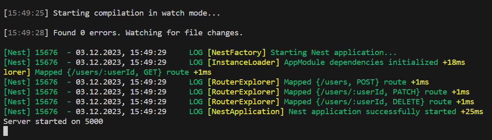
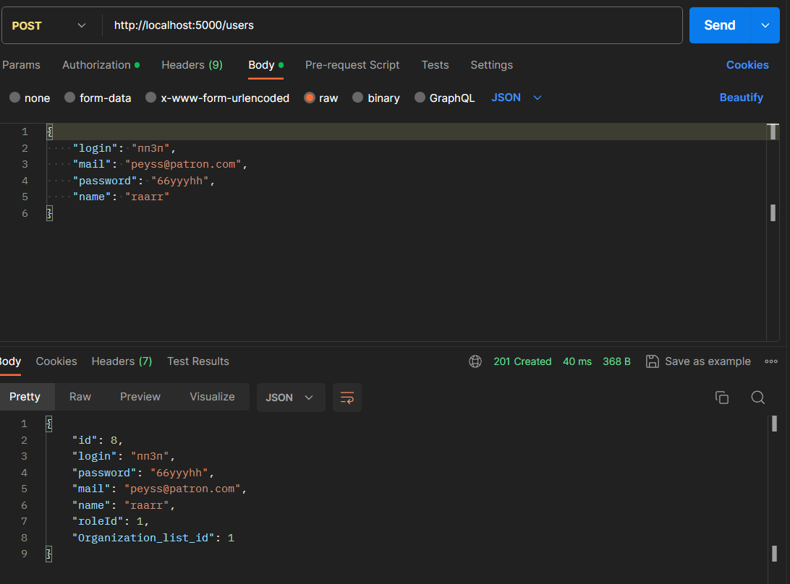
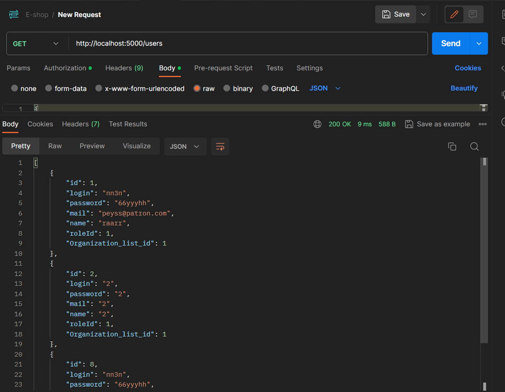
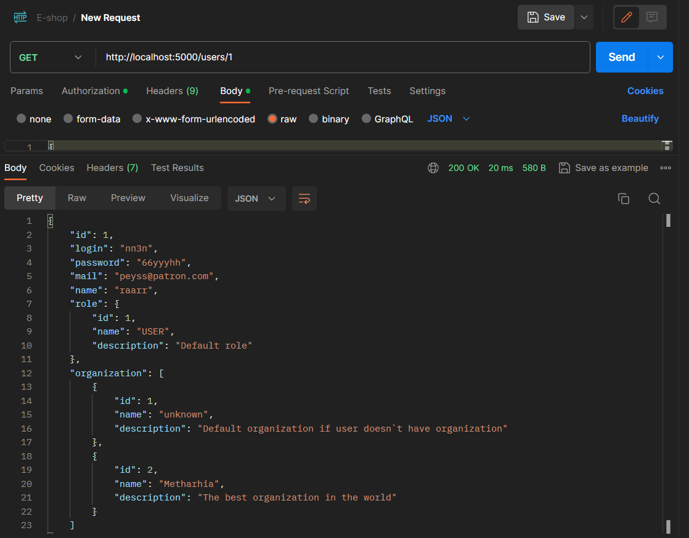
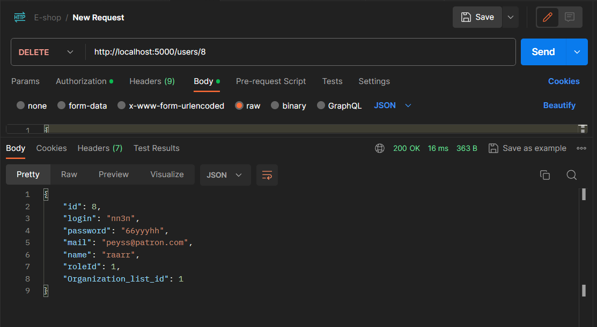
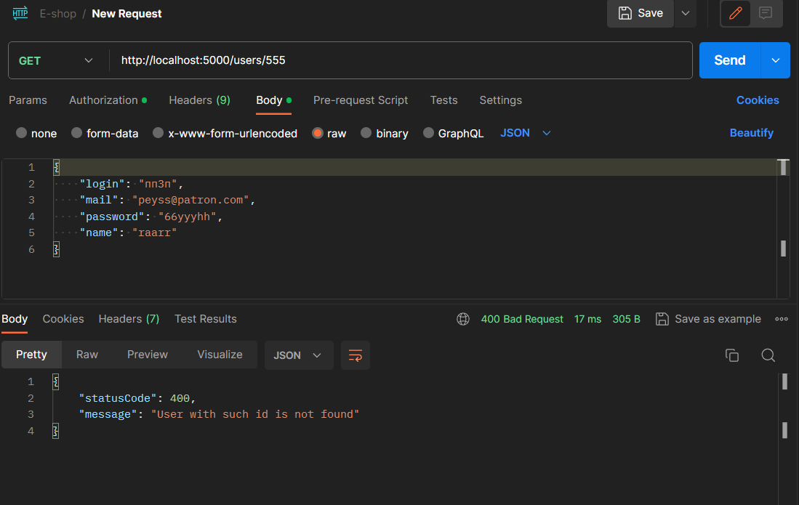
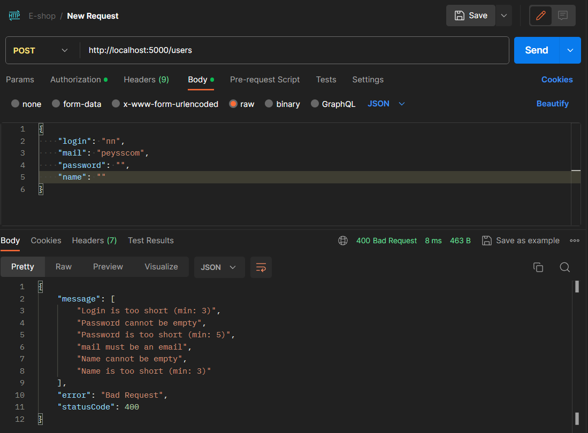

# Тестування працездатності системи

## Запуск системи

## POST запит 

## GET (отримати всіх користувачів)

## GET (по індентифікатору)

## PATCH

## DELETE

## Обробка помилки: "Користувач з таким індетифікатором не був знайдений"

## Обробка помилки: "Дані для створення користувача були неправильно вказані"

