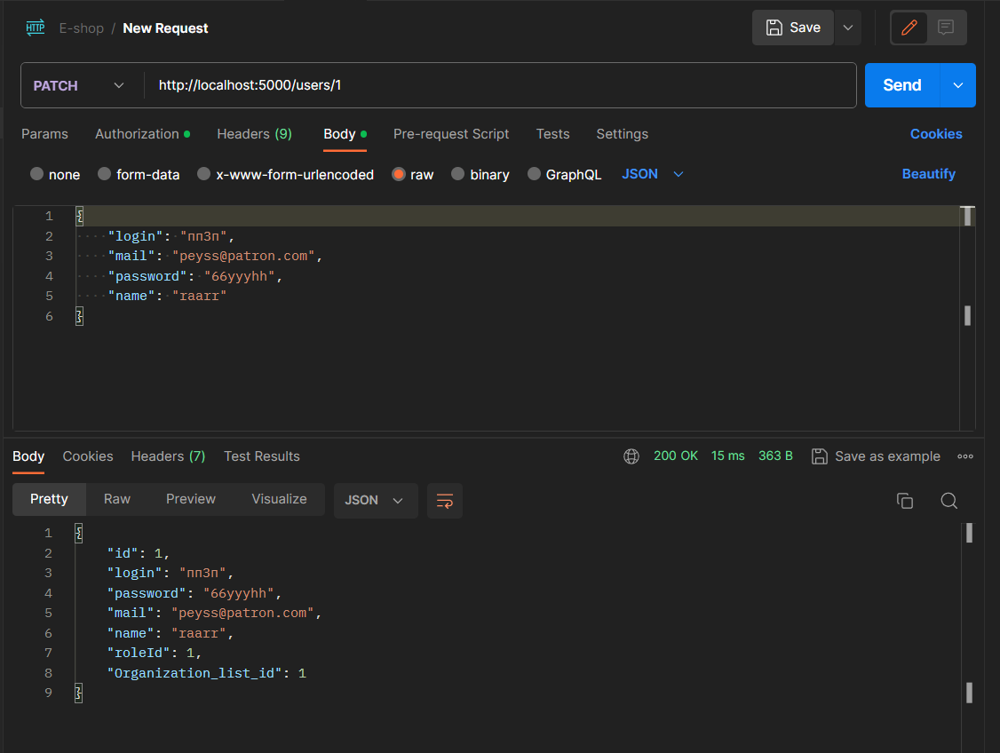

# Тестування працездатності системи

## Запуск системи

    

## POST запит 

    

## GET (отримати всіх користувачів)

    

## GET (по індентифікатору)

    

## PATCH

    

## DELETE

    

## Обробка помилки: "Користувач з таким індетифікатором не був знайдений"

    

## Обробка помилки: "Дані для створення користувача були неправильно вказані"

    

